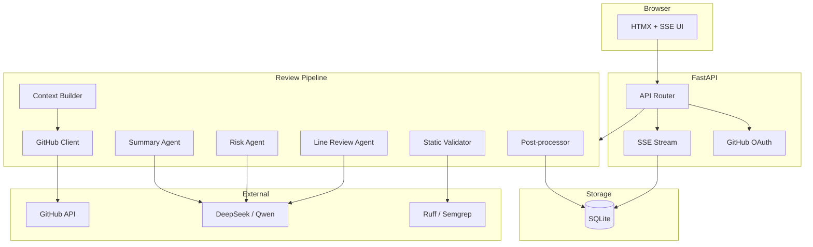
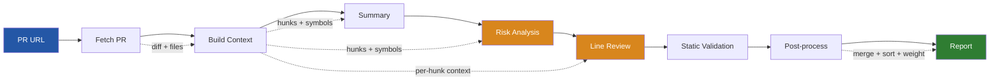
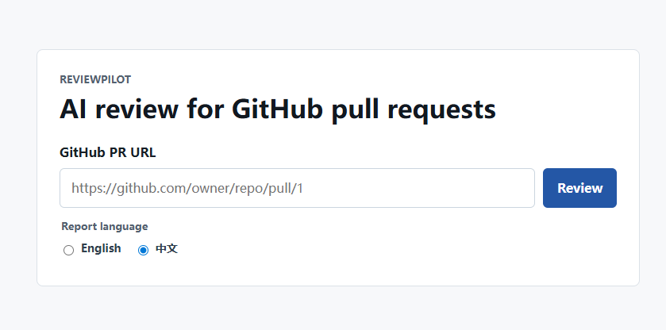
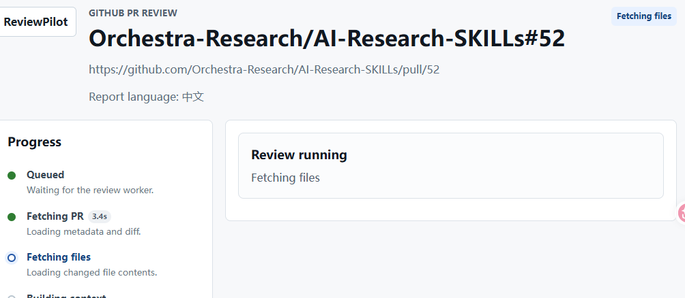
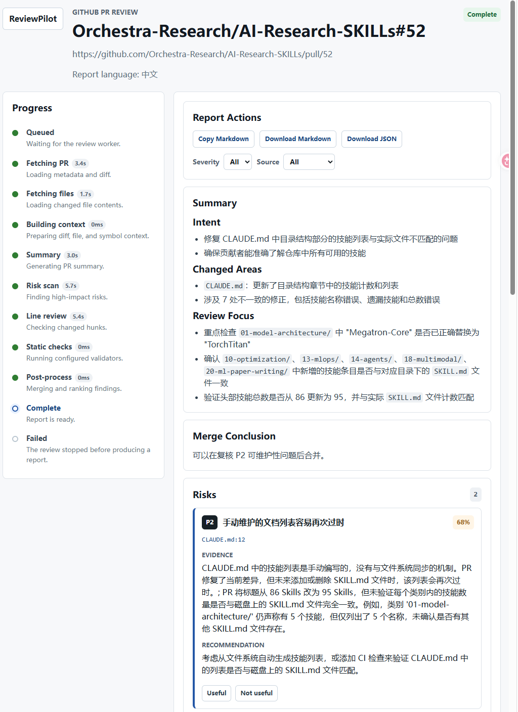

# ReviewPilot

> AI 驱动的 GitHub Pull Request 代码审查助手 | AI-Powered GitHub PR Review Assistant

---

## 项目介绍

ReviewPilot 是一个面向真实 GitHub Pull Request 的 AI 代码审查应用，基于 FastAPI + Jinja2 + HTMX/SSE 构建。输入 PR 链接后，系统会联网拉取 PR metadata、diff 与变更文件，构建审查上下文（diff + 文件内容 + 多语言 AST 符号表），再通过 LLM 与静态校验器生成可定位、可导出、可回写的结构化审查报告。

- **Markdown 摘要**：作者意图与变更区域分析
- **风险发现**：按严重度（P0/P1/P2/P3）分级，附带文件路径、行号与置信度
- **行内审查**：针对每个变更 hunk 的具体修改建议
- **合并结论**：基于所有发现的综合合并建议
- **中英文报告**：网页端与 CLI 均可选择中文或英文输出
- **Diff 定位**：报告中的文件行号可跳转到对应 diff 行
- **阶段耗时**：进度栏展示 fetch、上下文构建、LLM 分析、静态校验等阶段耗时
- **报告操作**：支持复制 Markdown、下载 Markdown/JSON、按严重度和来源过滤发现
- **反馈闭环**：支持对每条发现投"有用/无用"，持久化至 SQLite

默认以离线模式运行，便于本地启动 UI 与跑通测试；接入 GitHub Token 与 LLM API Key 后，即可进行真实联网 PR 审查。

### English Introduction

ReviewPilot is an AI-assisted code review tool for real GitHub pull requests,
built on FastAPI + Jinja2 + HTMX/SSE. Given a PR URL, it fetches PR metadata,
diffs, and changed files, builds review context (diff + file content +
multi-language AST symbol table), then generates a structured report with LLM
agents and optional static validators:

- **Markdown summary** of the author's intent and changed areas
- **Risk findings** with severity (P0-P3), confidence, file path, and line evidence
- **Inline reviews** for individual diff hunks
- **Merge recommendation** derived from all findings
- **Chinese/English report language** for both web and CLI workflows
- **Diff navigation** from findings to the exact changed line
- **Stage timings** for fetch, context building, LLM analysis, validation, and post-processing
- **Report actions** for copying Markdown, downloading Markdown/JSON, and filtering findings
- **Feedback loop** with up/down voting persisted to SQLite

Runs offline by default — no credentials needed for UI exploration or tests.
Connect a GitHub token and LLM API key to review real PRs.

## 系统架构 / Architecture



## 审查流程 / Review Pipeline



## 界面展示 / Screenshots

### 首页 / Home

输入 GitHub PR URL，并选择报告语言（English / 中文）。



### 审查进行中 / In Progress

SSE 实时推送流水线状态，进度栏展示每个阶段的耗时。



### 审查报告 / Report

报告页展示摘要、合并结论、风险发现、行内审查、Diff 定位、Markdown/JSON 导出与发现过滤。



---

## Requirements

- Python 3.11 or newer
- Git, required for local checkout helpers
- A GitHub token for live PR fetching, especially for private repositories
- A DeepSeek or Qwen API key if you want real LLM analysis

Dependencies are pinned in `requirements*.txt`. This project does not require
`uv`.

## Install

Create or activate your Python environment, then install development
dependencies:

```powershell
python -m pip install -r requirements-dev.txt
```

If you only need runtime dependencies:

```powershell
python -m pip install -r requirements.txt
```

Optional Semgrep dependencies are needed if you use `REVIEW_STATIC_VALIDATOR=semgrep`
or `ruff+semgrep`:

```powershell
python -m pip install -r requirements-optional.txt
```

## Configure

Copy the example environment file and edit local values:

```powershell
Copy-Item .env.example .env
```

Offline mode is the default and does not need secrets:

```env
REVIEW_FETCH_MODE=offline
REVIEW_LLM_PROVIDER=offline
REVIEW_STATIC_VALIDATOR=none
```

Use this mode for UI checks, tests, and local pipeline smoke tests. It does not
fetch real PR content.

For live GitHub + DeepSeek review:

```env
APP_SECRET_KEY=replace-with-a-local-random-secret
REVIEW_FETCH_MODE=github
REVIEW_LLM_PROVIDER=deepseek
REVIEW_STATIC_VALIDATOR=ruff
GITHUB_PAT=github_pat_or_fine_grained_token
DEEPSEEK_API_KEY=deepseek_key
DEEPSEEK_BASE_URL=https://api.deepseek.com
DEEPSEEK_MODEL=deepseek-chat
```

`REVIEW_STATIC_VALIDATOR` runs static analysis tools against fetched file contents
and merges diagnostics into the risk list. Supported values: `ruff`, `semgrep`,
or `ruff+semgrep` to run both.

To use Qwen instead of DeepSeek:

```env
REVIEW_LLM_PROVIDER=qwen
QWEN_API_KEY=your_qwen_key
QWEN_BASE_URL=https://dashscope.aliyuncs.com/compatible-mode/v1
QWEN_MODEL=qwen2.5-coder
```

Production deployments should split the session secret into separate signing and
encryption keys:

```env
APP_SECRET_KEY=replace-with-a-local-random-secret
SESSION_SIGNING_KEY=replace-with-a-local-random-signing-key
SESSION_ENCRYPTION_KEY=replace-with-a-local-random-encryption-key
APP_ENV=production
```

Supported configuration values:

| Variable | Default | Values |
| --- | --- | --- |
| `REVIEW_FETCH_MODE` | `offline` | `offline`, `github` |
| `REVIEW_LLM_PROVIDER` | `offline` | `offline`, `deepseek`, `qwen` |
| `REVIEW_STATIC_VALIDATOR` | `none` | `none`, `ruff`, `semgrep`, `ruff+semgrep` |

GitHub OAuth login is optional. Configure it if you want the browser session to
provide the GitHub token instead of relying only on `GITHUB_PAT`:

```env
GITHUB_CLIENT_ID=your_oauth_client_id
GITHUB_CLIENT_SECRET=your_oauth_client_secret
APP_SECRET_KEY=replace-with-a-local-random-secret
```

GitHub OAuth App settings for local development:

```text
Homepage URL: http://localhost:8000
Callback URL: http://localhost:8000/auth/github/callback
```

## Run The Web App

Start the local server:

```powershell
python -m uvicorn reviewpilot.main:app --host 127.0.0.1 --port 8000 --reload
```

Open:

```text
http://127.0.0.1:8000/
```

Use the review form:

1. Paste a GitHub PR URL, for example `https://github.com/OWNER/REPO/pull/123`.
2. Choose the report language: English or 中文.
3. Submit the form.
4. The result page opens at `/review/{job_id}`.
5. Progress is streamed through `/review/{job_id}/stream`.
6. When complete, the page shows Summary, Merge Conclusion, Risks, Inline
   Reviews, Diff, stage timings, report actions, and feedback buttons.

If OAuth is configured, visit `/auth/github/login` first, complete GitHub login,
and then submit PR URLs from the web UI.

## CLI

The CLI provides `fetch` and `review` subcommands.

### Fetch PR snapshots

Fetch PR metadata, commits, changed files, and diff as JSON:

```powershell
python -m reviewpilot fetch https://github.com/OWNER/REPO/pull/123
```

Print only the unified diff:

```powershell
python -m reviewpilot fetch https://github.com/OWNER/REPO/pull/123 --format diff
```

Use a token explicitly:

```powershell
python -m reviewpilot fetch https://github.com/OWNER/REPO/pull/123 --token github_pat_or_token
```

If `--token` is omitted, the CLI reads `GITHUB_PAT` or `GITHUB_TOKEN` from the
environment.

### Run a full review

Run the configured AI review pipeline and print a Markdown report:

```powershell
python -m reviewpilot review https://github.com/OWNER/REPO/pull/123
```

Options:

```powershell
python -m reviewpilot review <pr_url> \
  --format json|markdown \   # default: markdown
  --out report.md \          # write to file instead of stdout
  --token github_pat \       # GitHub token (falls back to env)
  --lang en|zh \             # report language
  --post-comment             # post review summary as a PR comment
```

Pipeline configuration (`REVIEW_FETCH_MODE`, `REVIEW_LLM_PROVIDER`,
`REVIEW_STATIC_VALIDATOR`) is read from `.env` / environment variables.

## Development Checks

Run the full test suite:

```powershell
python -m pytest
```

Run lint checks:

```powershell
python -m ruff check .
```

Compile Python files:

```powershell
python -m compileall reviewpilot tests
```

## Project Layout

```text
reviewpilot/
  api/          FastAPI routes for review, auth, and feedback
  analyzer/     summary, risk, line-review agents and prompts
  auth/         GitHub OAuth and signed session helpers
  context/      diff parsing, file trimming, multi-language AST context
  fetcher/      GitHub API and local git checkout helpers
  post/         finding merge, sorting, confidence, report assembly
  static/       CSS and JavaScript for the HTMX/SSE UI
  templates/    Jinja2 pages and report partials
  validator/    Ruff and Semgrep validator integration points
tests/          unit and API tests
docs/           design, prompts, slides, and handoff notes
examples/       sample PR payloads
```

## Future Plan / 未来计划

ReviewPilot 当前已经具备真实 PR 拉取、上下文构建、LLM 审查、静态校验、网页报告、CLI 和 GitHub 评论回写能力。后续计划按“演示体验 → 审查质量 → 工程化集成”的顺序推进：

1. **更强的 Diff 审查体验**：将当前 unified diff 扩展为 side-by-side diff，支持只看有发现的文件、折叠无关 hunk、从风险卡片高亮对应行。
2. **大 PR hunk 优先级排序**：替代固定前 20 个 hunk 的预算策略，按新增代码、热点文件、调用链影响、静态风险信号给 hunk 打分，优先审查最值得看的部分。
3. **GitHub Actions 集成**：提供一键 CI 工作流，在 PR 中自动运行 ReviewPilot，并将 P0/P1 发现回写为 PR review 或 inline comment。
4. **浏览器辅助入口**：在 Web 版稳定后，再考虑轻量浏览器插件，用于在 GitHub PR 页面打开 ReviewPilot 面板或一键带入当前 PR URL。
5. **更完整的静态校验解释**：在 UI 中解释 LLM 发现是否有 Ruff/Semgrep 支撑、置信度为何升降，并展示 validator 原始规则编号。
6. **报告历史与对比**：支持按 PR 保存多次审查结果，比较同一 PR 不同 commit 或不同模型下的风险变化。
7. **部署与运维**：补充 Dockerfile、docker-compose、生产环境配置示例、健康检查和基础监控指标。
8. **离线资产与 UI polish**：移除 highlight.js CDN 依赖，提供本地静态资源；继续优化移动端布局、长文本折行和筛选交互。

## Current Limitations

- Diff hunk review is capped at 20 hunks per job (a P3 finding is emitted when
  truncation occurs).
- `get_settings()` caches the first read; runtime env changes require a restart.
- Frontend report streaming depends on a browser `EventSource` connection; there
  is no reconnect with missed-event catch-up.
